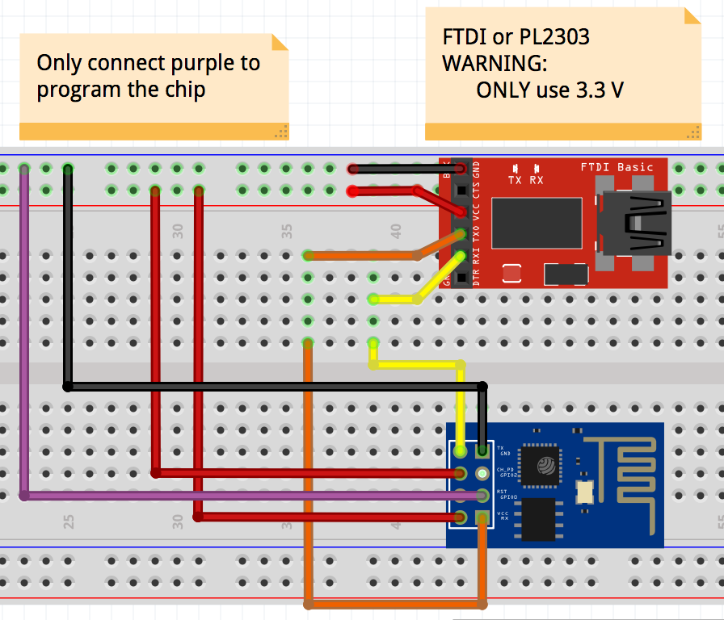

Configure Arduino IDE for ESP8266
-------------------------

## Simplified steps as of of Arduino IDE 1.6.8 with ESP2866 library version 2.2.0-rc1

* Start Arduino (Note: Assuming version 1.6.8)
* Click 'Arduino' -> 'Preferences'
    * Additional Boards Manager URLs: http://arduino.esp8266.com/staging/package_esp8266com_index.json
* Restart Arduino IDE
* Click 'Tools' -> 'Board' -> 'Boards Manager'
    * Select 'Generic ESP8266 Module' # NOTE: Assuming version 2.2.0-rc1 or greater
* Click 'Tools' -> 'Board' -> 'Generic ESP8266 Module'
* Click 'Tools' -> 'Upload Speed' -> '460800'  # I am impatient and this seems to work, even though the IDE warns about it
* Click 'Tools' -> 'Port' -> Select your port
* Upload your sketch

### Note: You can still use esptool.py if you want

* https://github.com/themadinventor/esptool
* Follow the steps below.  The same command should work with any version

```
perl -i -pe "s#tools.esptool.upload.pattern=.*#tools.esptool.upload.pattern=/usr/bin/python ${HOME}/bin/esptool.py --port \"{serial.port}\" write_flash 0x00000 \"{build.path}/{build.project_name}.bin\"#" `cd ~/Library/Arduino15/packages/esp8266/hardware/esp8266/; ls -d -1 $PWD/*|tail -1`/platform.txt
```

## Steps required for previous versions

* See: https://github.com/esp8266/Arduino
* Remove old possibly conflicting config

```
mv ~/Library/Arduino15 ~/Library/Arduino15-old
mkdir ~/Library/Arduino15
cp ~/Library/Arduino15-old/preferences.txt ~/Library/Arduino15
```
* Start Arduino (Note: Assuming version 1.6.7)
* Click 'Arduino' -> 'Preferences'
    * Additional Boards Manager URLs: http://arduino.esp8266.com/staging/package_esp8266com_index.json
* Restart Arduino IDE
* Click 'Tools' -> 'Board' -> 'Boards Manager'
    * Select 'Generic ESP8266 Module' # NOTE: Assuming version 2.1.0-rc2 (see replace below)
* Stop Arduino IDE
* Install pyserial, esptool, and reconfigure IDE to use pyserial

```
sudo pip install pyserial
mkdir ~/bin
cd /tmp && git clone https://github.com/themadinventor/esptool && cp esptool/esptool.py ~/bin/esptool.py

# Note: using command line substitution with ${HOME} below because the platform.txt file cannot interpret ~
perl -i -pe "s#tools.esptool.upload.pattern=.*#tools.esptool.upload.pattern=/usr/bin/python ${HOME}/bin/esptool.py --port \"{serial.port}\" write_flash 0x00000 \"{build.path}/{build.project_name}.bin\"#" `cd ~/Library/Arduino15/packages/esp8266/hardware/esp8266/; ls -d -1 $PWD/*|tail -1`/platform.txt
```

* Start Arduino IDE
* Connect your ESP8266
* Upload your sketch


FTDI or PL2303 Connection
-------------------------

